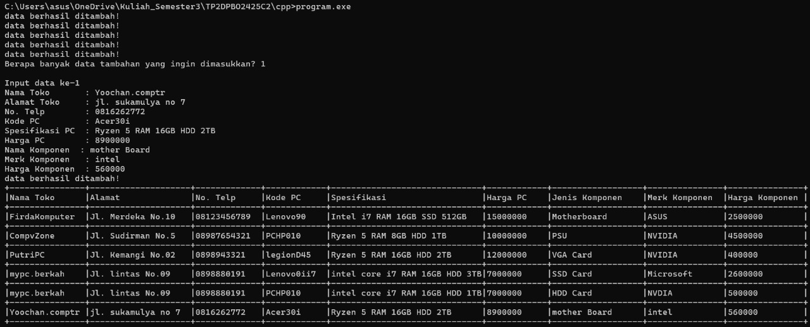

Saya Firda Ridzki Utami dengan NIM 2401626 mengerjakan TP2 dalam praktikum mata kuliah DPBO untuk keberkahannya maka saya tidak melakukan kecurangan seperti yang telah dispesifikasikan. Aamin
Relasi antar class :
- Terdapat tiga class utama yang pertama merupakan class parent yang bernama TokoElektronik yang memiliki atribut (namaToko, alamat, noTelp) dan method add data TokoElektronik.
- TokoElektronik memiliki child yaitu class TokoKomputer yang memiliki atribut (kode pc, spesifikasi pc, hrga pc) dan memiliki method add data TokoKomputer.
- TokoKomputer memiliki child (cucu dari Tokoelektronik) yaitu TokoKomponen komputer yang memiliki atribut (Jenis/nama komponen komputer, merk komponen komputer, harga komponen komputer) dan memiliki method add data Komponen.
Ketiga data toko diisi dengan menggunakan method add data dengan meminta inputan dari user, dan membuat 5 data secara hardcode.
Seluruh data ditampikan dalam satu tabel dengan menggunakan tabel dinamis dengan melalui kelas cucu (TokoKomponen), karena kelas ini secara otomatis mewarisi semua atribut dan method dari parent dan child, sehingga mampu menampilkan informasi toko secara lengkap dalam satu kesatuan.

